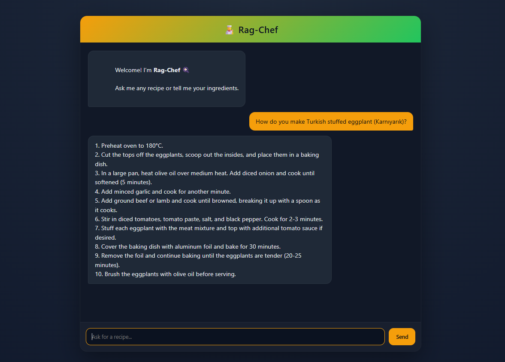

# 🍳 Rag-Chef: Intelligent Recipe Retrieval System

Rag-Chef is a specialized RAG pipeline that processes unstructured recipe PDFs into structured embeddings, combining regex-based document parsing, semantic retrieval, and local LLM inference to provide grounded and context-aware cooking assistance.


## Overview

<p align="center">
  
</p>

Rag-Chef enables natural language interaction with recipe data by retrieving relevant context from a curated vector database and generating precise, reliable responses.

Unlike generic chatbot systems, Rag-Chef is explicitly designed to minimize hallucinations and maximize factual grounding by strictly conditioning responses on retrieved data.

### Key Features

- 🔍 **Natural Language Search**  
  Query recipes using conversational input.

- 🥗 **Ingredient-Based Recommendations**  
  Discover meals based on available ingredients.

- 📖 **Step-by-Step Guidance**  
  Retrieve structured cooking instructions.

- 📂 **Structured Knowledge Extraction**  
  Convert raw PDFs into semantically rich data.

- 🧩 **Hallucination-Controlled Responses**  
  Answers are strictly grounded in retrieved content.


## System Architecture

### 1. Intelligent Document Parsing
Rag-Chef avoids naive chunking strategies by implementing a **custom regex-based parsing pipeline** that:

- Identifies recipe boundaries  
- Extracts structured metadata (e.g., preparation time, difficulty)  
- Separates logical sections:
  - Ingredients  
  - Instructions  
  - Tips  

This preprocessing step significantly improves downstream embedding quality and retrieval performance.


### 2. Asymmetric Embedding Strategy
The system utilizes `intfloat/multilingual-e5-base` with query-passage alignment:

- Indexed documents → `"passage: ..."`  
- User queries → `"query: ..."`  

This asymmetric setup enhances semantic matching and retrieval accuracy.


### 3. Grounded Generation (Anti-Hallucination)
To ensure reliability:

- The LLM is constrained via **strict prompt engineering**  
- Responses are generated **only from retrieved context**  
- If insufficient data is available, the system explicitly returns:

> “I do not have enough information to answer this.”


### 4. Local LLM Inference
- Powered by **Ollama**  
- Model: `llama3.2:3b`  

**Benefits:**

- 🔒 Full data privacy (no external API calls)  
- 💰 Zero operational cost  
- ⚡ Low-latency inference  


### 5. Scalable Vector Search
- Vector database: **Qdrant Cloud**  

**Capabilities:**

- High-performance semantic search  
- Scalable embedding storage  
- Efficient similarity retrieval  


### 6. Backend Architecture
- Built with **Flask**  

**Responsibilities:**

- RAG pipeline orchestration  
- API layer management  
- Request handling and response generation
  


## Tech Stack

| Layer            | Technology                      |
|------------------|--------------------------------|
| Language         | Python                         |
| LLM Inference    | Ollama (`llama3.2:3b`)         |
| Vector Database  | Qdrant Cloud                   |
| Embeddings       | intfloat/multilingual-e5-base  |
| PDF Processing   | pdfplumber                     |
| Backend          | Flask                          |
| Frontend         | HTML, CSS, JavaScript          |


## Setup & Installation

### 1. Clone the Repository

```bash
git clone https://github.com/yarenkeles1/rag-chef
cd rag-chef
   ```

### 2. Install Ollama Model

Ensure Ollama is installed, then pull the model:

```bash
ollama pull llama3.2:3b
   ```

### 3. Install Dependencies

```bash
pip install -r requirements.txt
   ```

### 4. Environment Configuration

Rename the example file and configure your credentials:

```bash
mv .env.example .env
   ```
Update the following variables:

```env
QDRANT_HOST=your_qdrant_url
QDRANT_API_KEY=your_qdrant_api_key
   ```

### 5. Data Ingestion

Build the vector database by processing recipe documents:

```bash
python data_ingestion.py
   ```

### 6. Run the Application

```bash
python app.py
   ```
   ```
